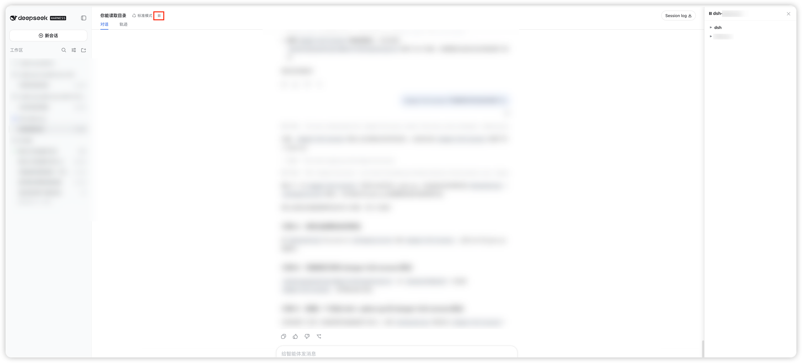
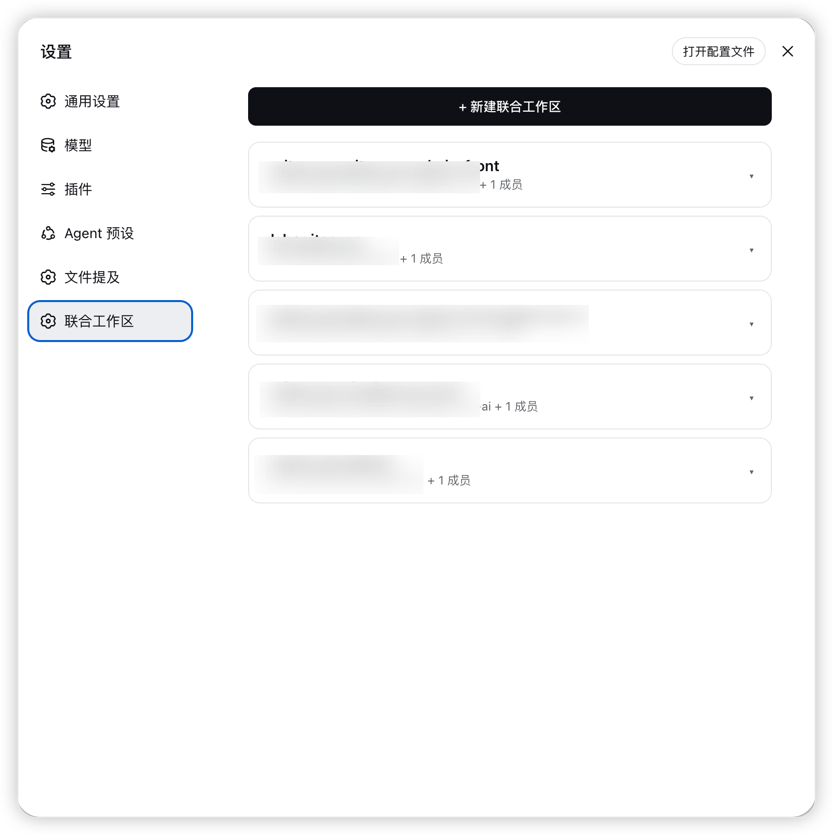

# dsh-plugin-uw

> Union Workspaces plugin for DSH — Merge multiple directories into one session.

English | [中文](./README.md)

[](https://github.com/lcgash/dsh-plugin-uw)
[](https://gitee.com/mr-chenguang/dsh-plugin-uw)
[](https://www.npmjs.com/package/dsh-union-workspace)

---

## The problem it solves

Full-stack development often means your code lives across several repos — frontend, backend, and a shared types or protocols package. To make a single cross-stack change, the AI needs to see and edit all of them at once.

Mount just one directory and the AI is blind to the others — the task simply fails. Mount a huge directory instead (your whole home, say) and you pay for it in **context explosion**: tool scans and file searches fan out across countless irrelevant files, burning tokens, degrading answer quality, and handing over far more directory access than you meant to.

**Union Workspaces** lets you merge **exactly the directories you need** into a single session. The AI reaches all of them at once, while the scope stays tight — it sees only what you picked, nothing outside it.

## Introduction

`dsh-plugin-uw` (Union Workspaces) lets you merge multiple directories into one session in the DSH Web GUI. A **primary** directory plus one or more **member** directories form a **union workspace**, giving the AI agent simultaneous access to all member directories.

## Screenshots

| Session file browser | Settings page |
|---|---|
|  |  |

## Features

- **Union workspaces** — Group two or more directories into one session so the agent can access all of them at once.
- **Two permission presets**:

  | Preset | Description |
  |---|---|
  | `workspace-write` (default) | Read/write/delete/move all member directories (via `uw_write`/`uw_edit`/`uw_delete`/`uw_move` tools) |
  | `danger-full-access` | Read/write everywhere (unrestricted) |

- **Sidebar integration** — Click the ⛓ icon in the sidebar footer to open the management panel.
- **Management panel** — Right-side panel with two tabs:
  - **Workspaces**: create, rename, delete unions and manage members.
  - **Files**: browse member directories in a tree view (lazy-loaded, recursive expansion).
- **Quick upgrade** — Upgrade an existing session via the `/uw` command or the header button.
- **Persistent storage** — Union definitions survive restart (`~/.dsh/union-workspaces.json`).
- **Auto-match** — Sessions opened from the sidebar are auto-matched to a union by workspace title.
- **Member directory tools** — The plugin registers `uw_read`, `uw_write`, `uw_edit`, `uw_delete`, and `uw_move` tools for reading, writing, deleting, and moving files in member directories, bypassing the sandbox single-root restriction. All member directories are readable, writable, deletable, and movable.
- **@mention** — Type `@` in the chat input to search files from all member directories, making it easy to reference files across the union.

## Installation

### Via DSH plugin command

```bash
# Install from GitHub
dsh plugin add github:lcgash/dsh-plugin-uw

# Or specify a profile (replace <name> with your profile name)
dsh plugin --profile <name> add github:lcgash/dsh-plugin-uw
```

### From npm

```bash
# Install globally
npm install -g dsh-union-workspace

# Or install into a DSH profile (replace <name> with your profile name)
dsh plugin --profile <name> add dsh-union-workspace
```

### From source

```bash
# Clone the repo
git clone https://github.com/lcgash/dsh-plugin-uw.git
cd dsh-plugin-uw

# Install dependencies
npm install

# Build
npm run build

# Install into a DSH profile (replace <name> with your profile name)
dsh plugin --profile <name> add link:$(pwd)
```

After installation, your `cordis.patch.yml` should include the plugin row:

```yaml
- insert:
    - id: union-workspace
      name: 'dsh-union-workspace'
```

## Usage

1. Click the ⛓ icon in the sidebar footer, or type `/uw`.
2. Choose a creation mode:
   - **Quick mode**: pick directories, name auto-generated.
   - **Custom mode**: set a name, choose members, select a permission preset.
3. After creation, the workspace appears in the sidebar.
4. Click the workspace in the sidebar to open a new session — it will be auto-marked as a union.
5. Click the ⛓ button in the session header to expand the member directory file browser.
6. The AI agent can use the `uw_read`, `uw_write`, `uw_edit`, `uw_delete`, and `uw_move` tools to read, write, delete, and move files in member directories directly (the standard `read`/`write`/`edit` tools are restricted to the primary workspace root by the sandbox).

## Development

```bash
# Build
npm run build

# Type-check
npm run typecheck
```

## Architecture

- **Host half** (`src/index.ts`) — runs in the DSH Node.js process, owns the union store (`~/.dsh/union-workspaces.json`), serves `/api/dsh-union-workspace/*` routes, and applies permission presets on session start.
- **Client half** (`src/client/index.ts`) — runs in the web GUI, registers locale dictionaries, settings section, conversation header badge/buttons, the `/uw` command, and mounts the overlay dialog and files panel via DOM injection.
- **Routes** (`src/routes.ts`) — REST API endpoints for listing, syncing, marking, and browsing union workspaces.
- **Tools** (`src/tools.ts`) — Registers `uw_read`, `uw_write`, `uw_edit` model tools for reading/writing member directory files, bypassing the sandbox single-root restriction.
- **Store** (`src/store.ts`) — persistent file-based store with sanitization and migration support.

## License

Apache-2.0